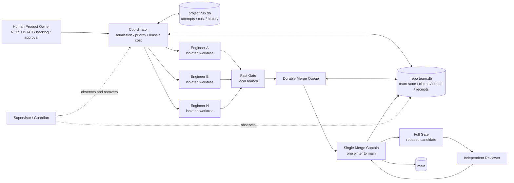

# AutoDev NG 真正多工程師並行、Ownership 與 Merge Queue 設計

日期：2026-08-14

狀態：設計基準；P0／P1 核心已部分實作，逐項現況以 [`2026-08-14-team-gap-acceptance-status.md`](./2026-08-14-team-gap-acceptance-status.md) 為準

範圍：本機多工程師協作、寫入權管理、持久化合併佇列與可驗收交付證據

不在本案：自動 `git push`、自動部署、跨主機分散式排程、AI 自動解 Git 衝突

## 1．結論

> 本節保留實作前的差距判斷；2026-08-14 本輪後的 PASS／PARTIAL／BLOCKED 證據請見上方狀態表。

AutoDev NG **目前還不能稱為真正的工程師團隊**。它已是一個具備隔離 worktree、機械驗證、語意審查、學習回饋、Supervisor 與 Guardian 的強單工工程迴圈；但 `concurrency > 1` 仍會降級為單工，現有 merge queue 只是一條進程內 Promise chain，沒有持久化 ownership、租約、重啟復原、獨立 reviewer 身分及精確一次合併保證。

最小且正確的演進路線如下：

1. **P0：先建立安全底座。** 在 `concurrency=1` 下完成硬驗證、持久化狀態、ownership、佇列復原及暫停語意，保持現有行為相容。
2. **P1：再開真正並行。** 由一個 Coordinator 管理 N 個 worker slot；每個 Engineer 只寫自己的 worktree；同一 repo 僅一個 Merge Captain 可寫主分支。
3. **P2：補齊團隊治理。** 加入獨立 Planner／Reviewer、靜態 code ownership、依賴圖、遠端 PR／CI 介面與人工發布核可。

核心原則只有一句：**可以同時思考與實作，但主分支永遠只有一個寫入者，而且每一次完成都必須綁定精確 commit 的可重播證據。**

## 2．目前基線與證據

| 能力 | 現況證據 | 判定 |
|---|---|---|
| 單輪生命週期 | [`runOnce()`](../../src/scheduler.ts#L66) 依序挑任務、建 worktree、執行、驗證、排隊合併與回報 | 已有完整單工骨架 |
| 工作隔離 | [`prepareWorktree()`](../../src/worktree.ts#L153) 為每個任務建立獨立分支與 worktree | 可直接沿用 |
| 主分支保護 | [`mergeBack()`](../../src/worktree.ts#L192) 檢查分支、tracked dirty、主分支倒退與 rebase 衝突 | 已有重要安全閘 |
| 合併序列化 | [`enqueueMerge()`](../../src/engines/merge-queue.ts#L7) 依 repo 串接 Promise | 僅限單一進程；崩潰後佇列消失 |
| 並行設定 | [`concurrency`](../../src/types.ts#L130) 已存在；[`concurrency-notice`](../../src/engines/concurrency-notice.ts#L11) 明示大於 1 尚未實作 | 只有設定骨架，不是真並行 |
| 合併後驗證 | [`mergeAfterRebaseVerify()`](../../src/scheduler.ts#L291) 先 rebase 再驗證 | 有正確切入點，但 `SKIP` 仍可通過 |
| 機械驗證 | [`runVerify()`](../../src/verify.ts#L11) 可執行專案指令 | timeout、command-not-found、spawn 異常目前回 `SKIP` |
| 語意與 review | [`Verifier`](../../src/verifier.ts#L42) 串接 judge 與可選 review gate | reviewer 不保證與 writer 獨立；基礎設施錯誤多為 fail-open |
| 執行監督 | [`superviseDirectory()`](../../src/supervisor/supervise.ts#L354) 與 [`runFleetGuardian()`](../../src/guardian/fleet.ts#L359) 會看 heartbeat、子行程與 `run.db` | 可沿用為 SRE／復原層 |
| Backlog 互斥 | [`withBacklogLock()`](../../src/backlog.ts#L96) 已有跨進程檔案鎖 | 可沿用；只有 Merge Captain 寫完成狀態 |
| 執行紀錄 | [`RunDb`](../../src/db.ts#L57) 已使用 SQLite WAL | 沿用 SQLite；repo 協調狀態另放 Git common dir，不需要 Redis 或新套件 |

本設計以目前原始碼為最終依據；`graphify-out/graph.json` 只用於縮小導覽範圍。

## 3．「真正團隊化」的完成定義

只有同時滿足下列條件，才可對外宣稱「像真正工程師團隊一樣運作」：

- 至少兩個互不衝突的 Engineer 任務能在時間上重疊執行，且測試能觀測到重疊。
- 每個寫入任務在開始前取得明確 ownership；未宣告範圍的任務安全降級為 repo 全域獨佔。
- 實際 diff 超出 ownership 時，系統拒絕合併，不靠提示詞自律。
- Worker、Coordinator 或 daemon 中斷後，任務與 merge queue 可從 `run.db` 復原，不重複執行或重複合併。
- 同一 repo 任一時刻只有一個 Merge Captain；Engineer 不得直接寫主分支。
- 候選分支 rebase 到最新主分支後，必須針對精確 candidate commit 執行必要 gate。
- 中高風險變更的 writer 與 reviewer 必須是不同執行身分；必要 reviewer 不可用時要阻擋，不能靜默略過。
- 暫停訊號出現後不再派新工作、不再啟動新的外部模型呼叫，也不再修改主分支。
- 每個 `DONE` 都能回答：是哪一次 execution、誰做、擁有哪些範圍、基於哪個 HEAD、跑過哪些 gate、誰審查、最後合併哪個 commit。
- 成本硬上限必須同時計入已花費與進行中保留額，不因平行派工超支。

## 4．目標架構



### 4.1 角色與權責

| 角色 | 可做 | 不可做 | 實作位置 |
|---|---|---|---|
| Human Product Owner | 定義 NORTHSTAR、任務優先度、風險與人工核可 | 不需手動處理每一個排程細節 | 現有 GOAL／backlog |
| Coordinator | 選任務、檢查依賴、保留成本、核發 lease／ownership、填滿 worker slots | 不直接改原始碼、不寫主分支 | 新的 coordinator；`runOnce()` 成為單工相容入口 |
| Planner | 產出結構化 write scopes、resources、風險、驗證指令 | 不取得寫入權、不修改 worktree | P2 獨立角色；P0／P1 可用明示任務 metadata |
| Engineer | 在被分配的 worktree 內修改、提交、跑 fast gate | 不寫主分支、不擴張 ownership、不自行標記 backlog done | 沿用現有 Engine adapter |
| Verifier | 對精確 commit 執行 deterministic gate | 不以模型文字取代指令結果 | 沿用並硬化 `runVerify()`／`Verifier` |
| Reviewer | 唯讀檢查最終 diff 與驗收條件 | 不得與該任務 writer 共用執行身分 | 硬化現有 review gate |
| Merge Captain | 依序 rebase、跑 final gate、fast-forward 合併、寫 receipt 與 backlog | 不修改候選內容、不自動解衝突 | 取代進程內 Promise queue |
| Supervisor／Guardian | 監看租約、heartbeat、子行程與失敗注入後復原 | 不把 heartbeat 或 PID 單獨當成完成 | 沿用現有監督層 |

### 4.2 排程邊界

不得用 `Promise.all([runOnce(), runOnce()])` 實作並行。`runOnce()` 目前同時負責挑選任務、成本判斷、backlog 回報及合併；直接平行呼叫會造成同一任務被挑兩次、成本超額及回報競態。

正確拆法：

```text
runCoordinatorCycle()
  -> recoverDurableState()
  -> fillAvailableSlots()
       -> selectCandidate()
       -> admitAndClaimInOneTransaction()
       -> executeClaimedTask()
  -> drainMergeQueueWithSingleCaptain()

runOnce()
  -> runCoordinatorCycle({ concurrency: 1, maxAdmissions: 1 })
```

這樣只保留一套生命週期；`concurrency=1` 與未設定 concurrency 時必須維持現有可觀測行為。

## 5．Ownership 設計

### 5.1 兩種 ownership 不混用

1. **Runtime write ownership（P0／P1）**：防止同時執行的任務寫到相同檔案或共享資源。
2. **Static code ownership（P2）**：決定哪些 reviewer 必須審查某個目錄或風險領域，功能類似 `CODEOWNERS`。

前者是正確性機制；後者是治理機制。只有 code ownership、沒有 runtime claim，仍會發生兩個 Engineer 同時修改同檔案。

### 5.2 Claim 類型

| 類型 | 範例 | 衝突規則 |
|---|---|---|
| `path:file` | `src/scheduler.ts` | 同一路徑 write/write 衝突 |
| `path:prefix` | `src/engines/` | 任一祖先／子孫 write scope 重疊即衝突 |
| `resource` | `package-lock`、`db-migration`、`generated-dashboard` | 同名資源只能有一個 writer |
| `global` | `repo:*` | 與 repo 內所有 write claim 衝突 |

讀取不需宣告且不互斥；寫入一律獨佔。首版不做多層讀寫鎖，因 Engineer 的主要危險是寫入衝突。

### 5.3 Claim 來源與安全降級

- P0／P1 優先接受任務上的結構化 ownership metadata；格式必須由 schema 驗證。
- Autopilot 產生任務時可附 ownership metadata，但不可直接取得 claim；仍須經 Coordinator 交易核發。
- 沒有 metadata、解析失敗、包含無法判定的產生檔或跨模組變更時，一律轉成 `global:repo`。
- 只有具備明確且互不重疊 write scopes 的任務可以並行；「可能安全」不算安全。
- P2 Planner 可自動提出 claims，但 Coordinator 仍以同一套 schema 驗證，失敗時回到全域獨佔。

P0／P1 的最小 metadata 契約固定為行尾 JSON 註記，不加入 glob 語法：

```markdown
- [ ] 修正排程並補測試 <!-- adng:ownership {"write":["src/scheduler.ts","tests/scheduler.test.ts"],"resources":[],"risk":"medium"} -->
```

```ts
type OwnershipMetadata = {
  write: string[]       // 檔案，或以 / 結尾的目錄 prefix
  resources: string[]   // package-lock、db-migration 等命名資源
  risk?: 'low' | 'medium' | 'high'
}
```

`write` 與 `resources` 至少一者非空；否則轉成 `global:repo`。`BacklogStore` 解析後必須把這段 metadata 從 Engine 任務文字剝離，但 `report()` 寫回 done／blocked 時必須逐字保留原註記，與既有 autopilot、split、engine tag 規則相容。資料庫另存 canonical manifest 與 hash，避免任務檔在執行中被改寫。

### 5.4 路徑正規化

所有 claim 在寫入資料庫前必須：

1. 轉為 repo-relative POSIX 路徑。
2. 拒絕絕對路徑、空路徑、NUL 與 `..` 跳脫。既有路徑以 realpath 驗證；新檔則解析最近的既有祖先，確認 symlink／junction 不會跳出 repo。
3. 在 Windows 上以 case-folded canonical key 比對，避免 `Src/A.ts` 與 `src/a.ts` 被視為不同檔案。
4. 目錄 claim 固定以 `/` 結尾；檔案與目錄的包含關係由同一個純函數按路徑 segment 判定，不能把 `src/a/` 誤判成涵蓋 `src/ab/`。
5. `resource` 名稱只允許 schema 白名單字元，不接受任意 shell 內容。

### 5.5 實際 diff 是最後防線

Engineer 完成 commit 後，由 host 執行：

```text
actualPaths = git diff --name-only <baseHead>...<candidateHead>
assert every actualPath is covered by an active write claim
assert ownership manifest hash still matches the admitted manifest
```

任何未覆蓋路徑都進入 `BLOCKED(ownership-drift)`，保留 worktree，不進 merge queue。不能因測試通過或 reviewer 認為合理而放行。

### 5.6 租約生命週期

- Claim 與不可猜測的 `lease_token` 綁定；所有狀態更新都要同時比對 `execution_id + lease_token`。
- Engineer heartbeat 延長 lease；只看時間不可判死，還要結合子行程與現有 Supervisor 的 liveness 證據。
- Claim 從 `CLAIMED` 持有到成功合併或進入終止狀態；等待 merge 時仍不可讓衝突任務先跑。
- Worker 確認死亡後才可收回 active claim；原 worktree 保留供復原或人工檢查。
- 進入 `BLOCKED`／`QUARANTINED` 後釋放 active claim，但保留歷史 manifest；日後恢復必須重新 admission、重新取得 ownership 並 rebase。
- 過期 worker 的晚到結果因 token 不符而失效，不能污染新 attempt。

## 6．持久化狀態與資料模型

沿用現有 `better-sqlite3` 與 WAL，不新增 Redis、訊息佇列或服務，但 ownership 與 merge queue **不能只放現有 `dataDir/run.db`**。同一個 Git repo 可能被不同設定或行程指向不同 dataDir；若各自持有一份 queue，就無法保證 repo 級單一寫入者。

Coordinator 必須先執行 `git rev-parse --git-common-dir`，解析並驗證 canonical common dir，再使用：

```text
<git-common-dir>/autodev-ng/team.db
```

所有 linked worktree、設定與 daemon 因此共享同一份 repo coordination DB。該檔位於 Git metadata，不會被加入工作樹或 commit。既有 `dataDir/run.db` 繼續保存 attempts、成本、引擎戰績與專案歷史；兩者職責不混用。

Schema migration 必須冪等，所有 admission／claim／lease 切換使用 `BEGIN IMMEDIATE`。無法安全解析 common dir、資料庫唯讀或損壞時，一律停止 admission，不得退回進程內 queue。

建議由新的 `src/engines/team-state.ts` 集中擁有下列表格與交易，避免把大量團隊化邏輯塞回核心 `scheduler.ts`：

```sql
CREATE TABLE IF NOT EXISTS team_tasks (
  execution_id TEXT PRIMARY KEY,
  task_id TEXT NOT NULL,
  config_id TEXT NOT NULL,
  backlog_line INTEGER NOT NULL,
  task_fingerprint TEXT NOT NULL,
  state TEXT NOT NULL,
  attempt INTEGER NOT NULL DEFAULT 0,
  worker_id TEXT,
  engine_id TEXT,
  lease_token TEXT,
  base_head TEXT,
  candidate_head TEXT,
  merged_head TEXT,
  branch TEXT,
  worktree_path TEXT,
  priority INTEGER NOT NULL DEFAULT 0,
  backlog_seq INTEGER NOT NULL,
  risk TEXT NOT NULL DEFAULT 'medium',
  reserved_cost_usd REAL NOT NULL DEFAULT 0,
  reserved_attempts INTEGER NOT NULL DEFAULT 0,
  ownership_hash TEXT,
  gate_bundle_hash TEXT,
  heartbeat_at TEXT,
  updated_at TEXT NOT NULL,
  last_error TEXT
);

CREATE UNIQUE INDEX IF NOT EXISTS one_live_execution_per_task
ON team_tasks(task_id)
WHERE state NOT IN ('DONE', 'BLOCKED', 'QUARANTINED');

CREATE TABLE IF NOT EXISTS ownership_claims (
  execution_id TEXT NOT NULL,
  kind TEXT NOT NULL,
  claim_key TEXT NOT NULL,
  mode TEXT NOT NULL CHECK (mode = 'write'),
  lease_token TEXT NOT NULL,
  active INTEGER NOT NULL DEFAULT 1,
  created_at TEXT NOT NULL,
  released_at TEXT,
  PRIMARY KEY (execution_id, kind, claim_key)
);

CREATE TABLE IF NOT EXISTS merge_queue (
  execution_id TEXT PRIMARY KEY,
  base_head TEXT NOT NULL,
  candidate_head TEXT NOT NULL,
  state TEXT NOT NULL,
  priority INTEGER NOT NULL,
  backlog_seq INTEGER NOT NULL,
  ready_at TEXT NOT NULL,
  attempts INTEGER NOT NULL DEFAULT 0,
  updated_at TEXT NOT NULL
);

CREATE TABLE IF NOT EXISTS gate_receipts (
  id INTEGER PRIMARY KEY AUTOINCREMENT,
  execution_id TEXT NOT NULL,
  candidate_head TEXT NOT NULL,
  stage TEXT NOT NULL,
  command TEXT NOT NULL,
  status TEXT NOT NULL,
  executed INTEGER NOT NULL,
  exit_code INTEGER,
  output_hash TEXT NOT NULL,
  reviewer_id TEXT,
  started_at TEXT NOT NULL,
  ended_at TEXT NOT NULL
);

CREATE TABLE IF NOT EXISTS team_leases (
  name TEXT PRIMARY KEY,
  holder_id TEXT NOT NULL,
  lease_token TEXT NOT NULL,
  heartbeat_at TEXT NOT NULL,
  expires_at TEXT NOT NULL
);
```

SQLite 無法用單一 UNIQUE constraint 判斷目錄前綴重疊，所以 Coordinator 必須在同一個 `BEGIN IMMEDIATE` 交易內讀取 active claims、用純函數判斷重疊、寫入 claims 與 `CLAIMED` 狀態。這是首版唯一必要的應用層鎖定邏輯。

不能用既有 `task_id` 當 execution 主鍵：它是任務文字雜湊，同文字的已完成任務與新開任務可共用相同 id。每次首次 admission 產生新的 `execution_id`；`task_id + backlog_line + task_fingerprint` 只用於復原核對。若重啟後 backlog 對不上，進入 `QUARANTINED(backlog-identity-mismatch)`，不得猜測目標行。`FAILED` 仍屬同一個 live execution，增加 `attempt` 後重試；達 `maxAttempts` 才轉 `BLOCKED`。

`attempts` 仍是成本與結果帳本；`team_tasks.reserved_cost_usd` 與 `reserved_attempts` 表示尚未結算的花費及 Engine 配額保留額。Admission 在持有 team DB 寫入交易時，同時計入相同 `config_id` 的 active reservations 與其 `run.db` 已結算成本，避免平行超額。

因 `team.db` 與 `run.db` 是兩個檔案，結算採 fail-closed 次序：先把帶 `execution_id` 的 attempt 寫進 `run.db`，成功後才把 `team.db` 的 reservation 標成 settled。若在兩步之間中斷，reservation 暫時保留，只會少派工而不會超支；reconcile 看到同一 `execution_id` 的 attempt 後再冪等清除。P0 migration 需為既有 `attempts` 新增 nullable `execution_id`，歷史列保持 `NULL`。

## 7．任務狀態機

```text
OPEN
  -> PLANNING
  -> CLAIMED
  -> RUNNING
  -> VERIFYING
  -> READY_TO_MERGE
  -> REBASING
  -> FINAL_VERIFY
  -> REVIEWING
  -> MERGING
  -> DONE

任一適用狀態 -> BLOCKED | FAILED | QUARANTINED
RUNNING/VERIFYING/READY_TO_MERGE + pause -> PAUSED_READY
PAUSED_READY + explicit resume -> READY_TO_MERGE 或重新 VERIFYING
```

規則：

- 每次 transition 都是 compare-and-set：`execution_id`、舊狀態與 `lease_token` 任一不符就拒絕。
- `FAILED` 表示可依既有 `maxAttempts` 重試的任務失敗；`BLOCKED` 表示需要改需求、處理衝突或修環境；`QUARANTINED` 表示狀態／證據不一致，禁止自動處置。
- `DONE` 只能由 Merge Captain 在主分支 fast-forward 成功、receipt 寫入成功後產生。
- Backlog 不是執行中鎖定來源；`run.db` 是 runtime state 真相源，backlog 仍是產品任務與最終狀態的真相源。
- 重啟時先 reconcile：比對主分支 HEAD、candidate commit、worktree、active lease 與 backlog 註記，再決定續跑、完成或隔離。

## 8．真正並行的 Worker Pool

### 8.1 Admission

Coordinator 填補空槽前，依序檢查：

1. stop sentinel 不存在。
2. 主 repo 目前分支正確且 tracked working tree 乾淨；不乾淨時在花費模型成本前阻擋。
3. 任務狀態為 `OPEN`，sequential split 的前置任務已 `DONE`。
4. ownership 與所有 active／ready-to-merge claims 不衝突。
5. `today billed cost + active cost reservations + candidate reservation <= hard cap`。
6. 該 Engine 的今日完成次數加 active attempt reservations 不超過配額，且隔離與 preflight 可用。
7. 以單一交易寫入 `CLAIMED`、claims、成本保留額與 lease。

只有交易成功者能建立 worktree 與呼叫 Engine。交易輸家重新選下一個候選，不重複派工。

### 8.2 Slot 與公平性

- `concurrency` 是 repo 級 worker slot 上限；預設仍為 1。
- 首版只需固定大小 Promise pool，不需要抽象工作佇列框架。
- 同優先度依 backlog 行序；其次依 task id，排序可重現。
- 不讓長任務永久擋住短任務，但 P0／P1 不做估時排程；先以 ownership 可相容及 backlog 順序為準。
- 不同 repo 互不阻塞；每個 repo 各有自己的 worker pool 與 Merge Captain lease。

### 8.3 暫停語意

偵測到 stop sentinel 後：

- 不挑新任務、不建立新 worktree、不啟動新的 Engine／Reviewer 呼叫。
- 已在執行中的 Engineer 可讓現有子行程安全結束並保存 commit；不得啟動下一階段外部呼叫。
- 可執行不會改主分支的本機收尾與證據保存，狀態寫成 `PAUSED_READY`。
- Merge Captain 在每個主分支變更點前重新檢查 sentinel；存在時不 rebase、不 merge、不寫 backlog done。
- 恢復必須是明確授權；復原後重新確認 HEAD、claim 與必要 gate，不能直接沿用過期 PASS。

## 9．持久化 Merge Queue

### 9.1 排序

每個 repo 只允許持有 `team_leases.name='merge-captain'` 的一個行程處理佇列。`holder_id` 必須包含主機、PID 與行程啟動指紋，避免 PID 重用誤判。租約逾時只是異常訊號，**不能單獨授權接管**；只有租約已過期且 Supervisor 以行程／heartbeat 證據確認舊 holder 死亡後，新 Captain 才能取得新 token。舊 holder 仍活著但卡住時停止 queue，先處理舊行程，不允許雙 Captain。

順序固定為：

```text
priority DESC, backlog_seq ASC, ready_at ASC, execution_id ASC
```

有 dependency 的任務即使較早 ready，也必須等前置任務 `DONE`。佇列排序不依賴 Promise 建立時機，因此重啟前後結果一致。

### 9.2 每筆合併流程

1. 取得或續租 Merge Captain lease。
2. 重新檢查 stop sentinel、主分支名稱、tracked dirty 與主分支 HEAD。
3. 驗證 candidate commit、worktree marker、ownership manifest 與實際 diff。
4. 將候選分支 rebase 到當前主分支；只允許一次機械 rebase，不自動選擇衝突內容。
5. 對 rebase 後的精確 candidate HEAD 執行 full mechanical gate。
6. 依風險政策執行 independent review；review 的 diff 必須是即將合併的最終 diff。
7. 確認 gate receipts 的 `candidate_head` 全部等於目前候選 HEAD。
8. 緊接主分支寫入前，再以 compare-and-set 續租 Captain token 並讀取 HEAD；以 fast-forward-only 更新主分支。token 或 HEAD 已改變時，放回 `READY_TO_MERGE` 重跑步驟 2 至 7。
9. 在資料庫記錄 merge receipt，再透過現有 backlog lock 標記 done。
10. 釋放 claims、成本保留額與 worker lease；最後才執行既有安全 cleanup。

### 9.3 失敗與復原

| 情境 | 處置 |
|---|---|
| rebase 衝突 | `BLOCKED(merge-conflict)`；主分支不變，保留 worktree |
| 主分支 tracked dirty | `BLOCKED(main-dirty)`；不呼叫模型、不自動 stash |
| gate timeout／command missing／spawn failure | 必要 gate 一律 `BLOCKED(verification-infra)` |
| reviewer 不可用 | reviewer 為必要時 `BLOCKED(review-unavailable)`；非必要時告警 |
| Captain 崩潰於 merge 前 | 新 Captain 由 DB 看到待處理項目，從 HEAD 驗證開始 |
| Captain 崩潰於 merge 後、receipt 前 | 以 main HEAD 是否已包含 candidate 判定；補 receipt，不再次 merge |
| receipt 已寫、backlog 未標 done | 冪等補寫 backlog；不再次執行 Engine 或 merge |
| candidate／worktree 不一致 | `QUARANTINED(evidence-mismatch)`，等待人工處理 |

精確一次效果靠「冪等狀態轉移＋commit graph 查證」達成，不宣稱分散式 exactly-once。

## 10．驗證與審查政策

### 10.1 風險分級

| 風險 | 範例 | 必要 gate |
|---|---|---|
| Low | 文件、單純測試資料、局部無行為改動 | fast mechanical gate；artifact contract 視任務適用 |
| Medium | 一般程式邏輯、API、資料轉換 | rebase 後 full verify 必須真實執行且 exit 0；獨立 reviewer PASS |
| High | 驗證鏈、排程、共享設定、安全、資料 migration、部署 | Medium 全部＋Human Product Owner 明確核可；禁止自動 push／deploy |

風險無法判定時預設 Medium；碰到安全、憑證、共享設定、刪除或外部寫入時升為 High。

有效風險取「系統偵測、靜態 ownership policy、人工標記」三者最高值。Autopilot、Planner 或 Writer 只能提高風險，不能把預設 Medium 自行降成 Low；只有人類建立的 backlog metadata 可以明示 Low。

分階段落地時：P0 先硬化機械 gate 並記錄 reviewer identity；P1 只允許有效風險 Low 的任務進入平行 lane，Medium／High 維持單工與既有人工邊界；P2 才開啟 Medium／High 的必要獨立 reviewer 與完整政策。故 P1 通過代表真並行執行能力，不代表完整團隊治理。

### 10.2 PASS／FAIL／BLOCKED 語意

- 設有 `verifyCommand` 時，只有 `executed=true && exitCode=0` 是 PASS。
- command not found、timeout、spawn 空結果及工具崩潰是 BLOCKED，不得算 `SKIP`。
- 只有「此 gate 經政策判定不適用」可用 SKIP，而且 receipt 必須記錄政策原因。
- 必要 reviewer 的 timeout、格式錯誤或服務錯誤是 BLOCKED。
- Reviewer 只能補充機械 gate，不能覆蓋失敗的 build／test。
- `DONE` receipt 至少包含 task、base HEAD、candidate HEAD、merged HEAD、ownership hash、所有 command／exit code／output hash、writer id、reviewer id 與時間。
- P0／P1 先沿用既有 `verifyCommand` 作 branch 與 rebase 後 final gate；沒有量測到明確效能瓶頸前，不新增 fast／full 兩套設定。final gate 一律重新執行，不能沿用 branch receipt。

## 11．完整團隊化差距表

| 能力 | 現況 | 核心差距 | 目標 | 優先級 |
|---|---|---|---|---|
| 真正並行 | 設定存在，但大於 1 降級單工 | 沒有 worker pool 與原子 admission | N 個隔離 Engineer 可實際重疊 | P1 |
| 任務唯一領取 | `nextTask()` 後才進執行 | 多排程者可能挑到同任務 | DB compare-and-set claim＋lease token | P0 |
| Runtime ownership | 無 | 無法在執行前判定寫入衝突 | 路徑／資源／全域 write claims | P0 |
| Ownership 漂移 | 只看產物與 commit | Engineer 可寫到宣告範圍外 | host 比對實際 diff，漂移即阻擋 | P0 |
| 路徑安全 | worktree 有邊界檢查 | claim 尚無 canonicalization | 防絕對路徑、`..`、symlink、大小寫碰撞 | P0 |
| Merge queue | 進程內 Promise chain | 不耐 crash、無狀態與 receipt | repo common-dir SQLite 持久化、可重啟、決定性排序 | P0 |
| Repo 協調範圍 | 進程內以 resolved path 分 queue | 不同 dataDir／daemon 看不到彼此 | common Git dir 唯一 team DB 與 Captain lease | P0 |
| 主分支單一寫入者 | merge function 內序列化 | 跨行程無 captain lease | repo 級 Merge Captain lease | P1 |
| Final-state gate | rebase 後會 verify | `SKIP` 仍可能通過；證據未綁定 commit | 精確 HEAD 的 required receipt | P0 |
| 驗證基礎設施錯誤 | 多數回 `SKIP` | 可能產生假完成 | 必要 gate fail-closed 為 BLOCKED | P0 |
| Reviewer 獨立性 | review 可選 | 不保證 writer／reviewer 不同 | 身分分離；中高風險為必要 | P2 |
| 成本上限 | 派工前讀今日成本 | 平行中的未結算成本未計入 | admission 交易內保留成本 | P1 |
| Engine 配額 | 派工前讀今日 attempt／token 狀態 | 多 worker 可能同時吃掉最後名額 | admission 交易內保留 attempt；token 只做可觀測預警 | P1 |
| Execution 身分 | `task_id` 是文字雜湊 | 同文字重開會共用 id | 每次 admission 有獨立 execution id 與 backlog 指紋 | P0 |
| Pause | scheduler／Supervisor 已檢查 sentinel | 中途完成後的 queue／merge 語意未定 | `PAUSED_READY`，主分支零變更 | P0 |
| Crash recovery | Supervisor／Guardian 可重啟 | 執行中 task／queue 無持久 lease | reconcile 後續跑或隔離，無重複 merge | P1 |
| 任務依賴 | sequential split 已存在 | 一般任務無 DAG | P1 先保留 sequential；P2 擴為 dependency DAG | P2 |
| Backlog 寫入 | 已有跨進程檔案鎖 | 多 worker 若各自 report 仍難稽核 | 只有 Merge Captain 標 done／blocked | P0 |
| 主分支 dirty preflight | merge 時才攔 | 可能先花模型成本才發現不能合併 | admission 前先攔，merge 前再驗 | P0 |
| 可觀測性 | events、heartbeat、run.db、Guardian | 看不到 slot、claim、queue age、receipt | 狀態 API／CLI 顯示完整團隊流水線 | P1 |
| Code ownership | 無 | reviewer 路由靠全域設定 | repo 內 owners policy＋風險規則 | P2 |
| 遠端 PR／CI | 本機直接合併 | 無 required checks／PR review 對接 | 可選 remote merge adapter | P2 |
| 發布治理 | 不屬目前本機 merge 流程 | 合併成功不等於可部署 | 人工授權＋部署／canary receipt | P2 |
| 交付證據 | attempt 與報告分散 | 無單一可驗證 evidence bundle | 每個 DONE 有 hash 綁定的 bundle | P0 起、P2 完整化 |

## 12．P0 驗收表：安全與真實性底座

P0 **不開啟並行**。目標是在 `concurrency=1` 下先讓新狀態、ownership 與 queue 可靠，避免把現有單工風險倍增。

| P0 項目 | 實作驗收 | 自動化證據 | 通過門檻 |
|---|---|---|---|
| 單工相容 | 未設 concurrency 與 `concurrency=1` 走同一 coordinator 核心 | `tests/run-once-concurrency-compat.test.ts` | 所有必要 gate PASS 的既有事件順序、Engine 呼叫數、結果與成本記帳不漂移；fail-open 改 fail-closed 是明示例外 |
| Team state migration | 新 `team.db` 可冪等建表；舊 `run.db` 可補 nullable execution id | `tests/team-state-machine.test.ts` | 重複初始化、關閉重開、兩行程競態首開皆通過，歷史 attempt 不漂移 |
| Repo 共用狀態 | 主 worktree、linked worktree、兩個不同 dataDir 指向同 repo | `tests/repo-team-db.test.ts` | 全部解析到同一 team DB；不安全 common dir 一律阻擋 |
| 原子狀態轉移 | 錯誤舊狀態或過期 token 不能更新 | `tests/team-state-machine.test.ts` | 每個非法 transition 回明確原因，資料不變 |
| Execution 身分 | 已完成同文字任務後再加入新任務 | `tests/team-state-machine.test.ts` | 產生不同 execution id；舊 receipt 不被覆蓋；回報命中正確 backlog 行 |
| Ownership 正規化 | 驗證檔案、目錄、資源與 global claim | `tests/ownership-claims.test.ts` | `..`、repo 外 symlink、Windows case collision 全部拒絕或判衝突 |
| Ownership 漂移 | candidate 實際 diff 必須被 claim 全覆蓋 | `tests/ownership-claims.test.ts` | 多一個未宣告檔案即 `BLOCKED`，主分支不變 |
| 安全降級 | 無／壞 ownership metadata 變成 repo 全域獨佔 | `tests/ownership-claims.test.ts` | 不會誤判為可並行 |
| 持久 merge queue | 單工候選入 DB queue，關閉再開仍存在 | `tests/merge-queue-durable.test.ts` | 次序、attempt、candidate HEAD 完整保留 |
| Merge 冪等復原 | 模擬 merge 後、receipt 前中斷 | `tests/merge-queue-durable.test.ts` | 重啟只補 receipt／backlog，不重複 merge |
| 驗證 fail-closed | configured verify 的 timeout、missing command、spawn failure 皆阻擋 | `tests/verification-hard-gate.test.ts` | 不得產生 DONE 或更新主分支 |
| 精確 commit receipt | gate receipt 與 candidate HEAD 綁定 | `tests/verification-hard-gate.test.ts` | HEAD 改變後舊 PASS 無效，必須重跑 |
| Dirty main 前置攔截 | 在 `engine.run()` 前檢查 tracked dirty | `tests/main-dirty-admission.test.ts` | Engine 呼叫數為 0；不 stash、不 reset |
| Pause 中途保護 | 執行中建立 sentinel 後保存 worktree、停止後續階段 | `tests/pause-midflight.test.ts` | 無新 Engine／Reviewer 呼叫，主分支與 backlog done 均不變 |
| Backlog 單一寫入 | Worker 不直接 report；Captain 以既有 lock 寫入 | `tests/team-state-machine.test.ts` | 完成註記只出現一次，原任務文字不變 |
| 全套回歸 | 型別、build、現有測試全部通過 | 下列 P0 gate 指令 | 零失敗、`git diff --check` 通過 |

P0 預定驗收指令：

```powershell
npx vitest run tests/run-once-concurrency-compat.test.ts tests/team-state-machine.test.ts tests/repo-team-db.test.ts tests/ownership-claims.test.ts tests/merge-queue-durable.test.ts tests/verification-hard-gate.test.ts tests/main-dirty-admission.test.ts tests/pause-midflight.test.ts
npm run typecheck
npm run build
npx vitest run
git diff --check
```

P0 完成定義：即使仍只跑一名 Engineer，系統已無法因 verify 基礎設施失效、過期結果、ownership 漂移或 queue 中斷而假稱完成。

## 13．P1 驗收表：真正多工程師並行

P1 才把既有 `concurrency` 從相容設定變成有效 worker slot。第一個實機 canary 只開 `concurrency=2`，且僅接有效風險 Low、ownership 明確的任務。

| P1 項目 | 實作驗收 | 自動化／實機證據 | 通過門檻 |
|---|---|---|---|
| 固定大小 worker pool | slot 數永不超過設定 | `tests/concurrency-pool.test.ts` | 量測 `maxActive === concurrency` |
| 真時間重疊 | 兩個不重疊 claims 的任務以 barrier 同時進入 RUNNING | `tests/concurrency-pool.test.ts` | 兩者執行區間確實相交；不是只看 Promise 數 |
| 衝突 admission | 同檔、父子目錄、同 resource、global claim 互斥 | `tests/ownership-admission.integration.test.ts` | 衝突任務執行區間不相交 |
| 無飢餓 | 前方任務因 ownership 衝突時，可挑後方相容任務 | `tests/ownership-admission.integration.test.ts` | 可執行任務能填滿空槽，排序仍可重現 |
| 成本與配額保留 | 多 worker admission 同時計入 active cost／attempt reservations | `tests/concurrent-cost-reservation.test.ts` | 任一交錯順序都不超過 hard cap 或 Engine attempt cap |
| 單一 Merge Captain | 兩個 daemon 競爭同 repo；另模擬驗證時間超過 lease TTL | `tests/merge-captain.integration.test.ts` | 任一時刻最多一名 Captain；live holder 不因逾時被偷 lease；queue 無遺失 |
| 決定性合併 | 兩個互不衝突候選依固定順序 rebase、final verify、ff-only | `tests/merge-captain.integration.test.ts` | 最終 main 同時含兩者；每個恰好一份 receipt |
| 真衝突隔離 | 兩候選起始 claim 不衝突，但 rebase 後產生 Git 衝突 | `tests/merge-captain.integration.test.ts` | 第二項 BLOCKED、主分支乾淨、worktree 保留 |
| Worker crash 復原 | 在 RUNNING 中止 worker，再啟 coordinator | `tests/concurrency-crash-recovery.test.ts` | 無雙重 active lease；舊 token 晚到結果失效 |
| Captain crash 復原 | 在 rebase、verify、merge 後三個邊界逐一中止，確認死亡後接管 | `tests/concurrency-crash-recovery.test.ts` | 每項最多合併一次；晚到舊 token 無效；狀態可收斂 |
| 並行暫停 | 兩 worker 執行中建立 sentinel | `tests/concurrent-pause-injection.test.ts` | 不派第三項、無主分支變更，完成者為 `PAUSED_READY` |
| 可觀測性 | status 顯示 slot、worker、claim、queue、lease、age 與阻擋原因 | `tests/team-status.test.ts` | API／CLI 與 DB fixture 一致，不把 paused 報成 dead |
| 單工回歸 | 同一版設 `concurrency=1` | P0 全套＋現有全套 | 與 P0 行為一致 |

P1 預定驗收指令：

```powershell
npx vitest run tests/concurrency-pool.test.ts tests/ownership-admission.integration.test.ts tests/merge-captain.integration.test.ts tests/concurrent-cost-reservation.test.ts tests/concurrency-crash-recovery.test.ts tests/concurrent-pause-injection.test.ts tests/team-status.test.ts
npm run typecheck
npm run build
npx vitest run
git diff --check
```

P1 必須另做一個有界 canary fixture，不碰真實專案：

```text
concurrency = 2
Task A owns src/a.ts
Task B owns src/b.ts
Task C owns src/a.ts

預期：
- A 與 B 的 RUNNING 區間重疊。
- C 在 A 釋放 claim 前不得 RUNNING。
- A、B 各合併一次；C 若以舊基底造成衝突則 BLOCKED。
- main 全程保持乾淨，queue 重啟後無重複項目。
- 每個 DONE 都有 candidate HEAD、final gate 與 merge receipt。
```

P1 完成定義：可以用可重現測試證明兩名 Engineer 真的同時工作，而不是只建立兩個 pane；同時仍能證明主分支只有一名 Captain 寫入。

## 14．P2 驗收表：團隊治理與遠端交付

| P2 項目 | 實作驗收 | 自動化證據 | 通過門檻 |
|---|---|---|---|
| Planner／Writer 分離 | Planner 只產生 schema 化 plan／claims | `tests/role-separation.test.ts` | Planner 執行環境無 worktree 寫入能力 |
| Writer／Reviewer 分離 | receipt 記錄兩個不同 identity | `tests/role-separation.test.ts` | 中高風險 identity 相同時拒絕 PASS |
| Required review | 中高風險 reviewer timeout／錯誤 | `tests/review-required-gate.test.ts` | 一律 BLOCKED，不能降級 SKIP |
| Static code ownership | 路徑命中 owners policy 時路由必要 reviewer | `tests/code-ownership.test.ts` | 所有命中規則均取得指定領域審查；無 owner 時安全阻擋或走預設 policy |
| Dependency DAG | 任務宣告 `dependsOn` | `tests/dependency-dag.test.ts` | 未完成前置任務永不 admission；cycle 在執行前拒絕 |
| PR／CI adapter | 以 fake provider 模擬 required checks | `tests/ci-required-checks.test.ts` | pending／failed check 不得進 merge；success 綁定精確 SHA |
| Branch protection 對齊 | 遠端模式不繞過 protected branch | provider integration fixture | 只透過 PR／merge queue；本機 ff 模式仍可獨立使用 |
| 發布人工核可 | 高風險 deploy action 需一次性 approval token | `tests/release-authorization.test.ts` | 無明確授權時 push／deploy 呼叫數為 0 |
| Canary 與回滾 | 部署後執行有界 health／console／核心流程檢查 | `tests/release-authorization.test.ts`＋staging canary | 失敗停止後續發布並保留證據；不自動做破壞性回滾 |
| Evidence bundle | 匯出單一 JSON／Markdown 交付包 | `tests/team-evidence-bundle.test.ts` | hash 可回指 exact commit、claims、gates、review、merge／CI 結果 |
| 團隊效能指標 | cycle time、queue wait、claim drift、conflict、reverify fail、review reject、cost／merge | `tests/team-status.test.ts` | 統計可由原始事件重算，空資料不造假 |

P2 預定驗收指令：

```powershell
npx vitest run tests/role-separation.test.ts tests/review-required-gate.test.ts tests/code-ownership.test.ts tests/dependency-dag.test.ts tests/ci-required-checks.test.ts tests/release-authorization.test.ts tests/team-evidence-bundle.test.ts tests/team-status.test.ts
npm run typecheck
npm run build
npx vitest run
git diff --check
```

P2 完成定義：系統不只會平行寫程式，也具備真實團隊的角色分離、必要審查、責任路由、CI 及人工發布邊界。

## 15．實作切片與檔案邊界

為避免過度設計，首版只新增必要模組，沿用現有 `RunDb`、worktree、Engine registry、Verifier、backlog lock、Supervisor 與 Guardian。

| 切片 | 主要檔案 | 內容 |
|---|---|---|
| P0-1 | `src/engines/team-state.ts` | Git common-dir team DB、SQLite schema、lease、狀態 transition、成本／配額保留額 |
| P0-2 | `src/engines/ownership.ts` | claim schema、正規化、重疊與 diff coverage 純函數 |
| P0-3 | `src/engines/merge-queue.ts` | 由 Promise chain 演進為 DB queue；保留相容入口直到 scheduler 切換完成 |
| P0-4 | `src/verify.ts`、`src/verifier.ts` | required gate fail-closed、commit-bound receipt |
| P0-5 | `src/scheduler.ts` | 最小接線：dirty preflight、狀態轉移、Captain 呼叫；不承載 ownership 細節 |
| P1-1 | `src/engines/concurrency-pool.ts` | 固定大小 Promise pool 與 cancellation admission gate |
| P1-2 | `src/engines/task-coordinator.ts` | slot 填補、原子 claim、Engine 執行、pause／recovery orchestration |
| P1-3 | status／events 現有模組 | 顯示 slot、claims、queue、receipts 與原因碼 |
| P2 | review／provider 現有模組加小型 policy 模組 | role identity、owners、dependency、PR／CI／release policy |

不建立通用 workflow framework、不引入 message broker、不建立每種角色各一套 class hierarchy。等單機 SQLite 的 contention 或吞吐量有量測證據後，再評估服務化。

## 16．上線順序與回退

1. **P0 schema shadow：** 建表與記錄狀態，但 `concurrency=1`，不改目前合併結果。
2. **P0 enforce：** 開啟 ownership drift、hard gate、durable serial queue；全套回歸通過。
3. **P1 fixture canary：** 只在臨時 repo 設 `concurrency=2`，執行成功、衝突、pause、worker crash、Captain crash 五組注入。
4. **P1 單一真專案 canary：** 必須另獲明確授權，先挑低風險、明確不重疊的兩個任務；限制一次批次。
5. **觀測穩定後擴大：** 以 conflict rate、claim drift、reverify failure、成本與復原時間決定是否提高 concurrency。
6. **P2 遠端模式：** 先 fake provider，再 staging PR；未授權不 push、不 deploy。

回退只需將 `concurrency` 設回 1；新資料表與 receipts 保留唯讀，不刪除、不降版資料庫。若 durable queue 本身異常，停止 admission 並保留 worktrees，禁止退回舊 Promise queue 繞過證據。

## 17．禁止宣稱完成的情況

下列任一情況存在，都只能說「部分完成」：

- 只看到兩個 agent／pane 存活，沒有時間重疊證據。
- 只有 Engine 自報成功，沒有 host 執行的 exact-commit gate。
- verify／review 因 timeout 或工具錯誤而 `SKIP`。
- queue 測試只在單一進程內，沒有關閉重開與 crash injection。
- 兩任務都成功，但沒有證明 claims 不重疊或實際 diff 未漂移。
- main HEAD 已更新，但 receipt、backlog 或 ownership 釋放尚未收斂。
- Guardian 顯示健康，但沒有功能性驗收結果。
- 遠端 CI／部署未實跑，卻宣稱 production-ready。

## 18．最終 Acceptance Gate

整體「真正工程師團隊」驗收必須同時具備：

```text
P0 全部通過
AND P1 全部通過
AND bounded concurrency=2 canary 通過
AND full test suite 通過
AND main working tree 在驗收前後皆乾淨
AND stop／resume／worker crash／captain crash 證據齊全
AND 每個 DONE 都能由 receipt 回推 exact commit
```

P2 是團隊治理與遠端交付成熟度；沒有 P2 時可以稱為「本機多工程師執行團隊」，但不能稱為具備完整 code ownership、PR／CI 與發布治理的軟體工程組織。
