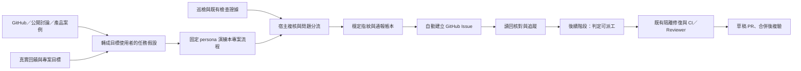

# 巡檢自動建立 GitHub Issue 與自主開發規劃

日期：2026-09-07。第一階段已實作並啟用。外部靈感、persona、去重、發送核對已接線；真實 Issue、兩輪完整回歸及背景巡檢證據見 [啟用驗收](../verification/github-reports-2026-09-07.md)。

## 目標與本次範圍

使用者希望 AutoDev NG 像專案團隊一樣，巡檢發現問題後，主動在自己的 GitHub 專案建立 Issue，逐步形成發現、立案、修復、審查與驗收的循環。

原始要求先規劃，後續已授權啟用與整合。第一階段的交付範圍是**自動開立有證據、可追蹤且不重複的 Issue**，來源包含工程巡檢、外部案例與使用者情境演練。除了已確認缺陷，也能建立明示為提案的體驗改善 Issue；來源與立案條件如下。自主派工與修復列為後續階段，沿用現有執行器，不另建一套代理排程系統。

## 已確認的基礎

以下為本次查閱原始碼與唯讀 API 的結果，不代表服務正在運行：

| 現有能力 | 可沿用的位置 | 本次缺口 |
|---|---|---|
| 讀取 Issue、建立 draft PR | [client.ts](../../src/github/client.ts) | 沒有主動建立 Issue、通報去重與發布後核對 |
| 帳號與所屬 repo 探索 | [owner.ts](../../src/github/owner.ts) | 要限定巡檢範圍與對應本地專案 |
| 接單與隔離修復 | [runner.ts](../../src/github/runner.ts)、[job.ts](../../src/github/job.ts) | 新通報不能因免標籤接單而立即觸發修復 |
| Issue 執行狀態、鎖與原子寫入 | [state.ts](../../src/github/state.ts)、[lock.ts](../../src/lock.ts) | 建立 Issue 前還沒有 Issue 編號，需獨立的通報狀態 |
| 巡檢、Guardian 與宿主獨立驗收 | [cli/supervise.ts](../../src/cli/supervise.ts)、[guardian/fleet.ts](../../src/guardian/fleet.ts) | 結果尚未進入 GitHub 通報流程；LLM 的 evidence 字串不能單獨作為發布依據 |
| 事件游標與事故辨識 | [guardian/incident.ts](../../src/guardian/incident.ts) | 既有事故指紋含程序／時間相關資訊，不宜直接當跨輪 Issue 身分 |
| 多視角發掘、critic 與問題帳本 | [discover.ts](../../src/autopilot/discover.ts)、[ledger.ts](../../src/autopilot/ledger.ts) | critic 故障有降級候選，帳本 I/O 採寬容處理；都不能直接授權對外發文 |
| 使用者訊號與模擬稽核 | [survey-sources.ts](../../src/autopilot/survey-sources.ts)、[50-persona 稽核規則](../portfolio-audit/2026-09-06-50-persona-audit.md) | 已有高權重 USER-SIGNALS 與固定 persona；仍缺外部靈感到本專案任務的證據轉換與自動立案接線 |

本機 `gh 2.100.0` 已登入 `Reese-max`。目前六份設定的 origin 與 GitHub 回覆一致，均未封存／停用、均開啟 Issues 且回報 push 權限：

| 設定名稱 | GitHub repo | 預設分支 | 可見性 |
|---|---|---|---|
| autodev-self | Reese-max/autodev-ng | main | 私人 |
| gooaye | Reese-max/gooaye | main | 私人 |
| neciken | Reese-max/neciken-summer-poem | master | 私人 |
| note-filler | Reese-max/note-filler | main | 私人 |
| prompt-autoresearch | Reese-max/prompt-autoresearch | master | 私人 |
| taiwan-intel | Reese-max/taiwan-intel-dashboard | main | 公開 |

**範圍假設：第一階段先涵蓋上表六個已設定專案。** 帳號下其他 repo 先做探索與覆蓋率報告，有專案對應及檢查契約後才加入。這是規劃預設，尚未改動任何運行設定。

六個設定所指向的 `data/<project>/NORTHSTAR.md` 目前均不存在。已證實的缺陷可以先通報；自主提出產品功能前，需要各專案一次性確立使用者、價值目標與非目標。遵循 [CLAUDE.md](../../CLAUDE.md)，本計畫不建立或切換 GOAL。

## 運作流程

巡檢、研究、情境演練、評審、通報與修復是責任分工，不代表每一環都新增模型或常駐 agent。模型可協助蒐整靈感、提出使用者任務與挑戰需求；證據格式、去重、額度與發布條件由宿主程式檢查。模型不能自訂 repo、檢查命令、權限或發布條件。

## 外部靈感與使用者視角

### 靈感從哪裡來

| 來源 | 要找的線索 | 採用方式 |
|---|---|---|
| 自己的 USER-SIGNALS、Issues／Discussions、既有回饋 | 使用者正在卡住的任務、反覆詢問與替代做法 | 優先於外部熱門功能；既有拒絕／不做的決策也要讀 |
| 同類 GitHub 專案的 Issues、Discussions、PR 與 release notes | 別人的使用障礙、設計取捨、已解決或拒絕的需求 | 讀完整討論及最後處置，保留來源 URL、日期、版本與適用情境 |
| 公開社群問答、論壇、教學與產品評價 | 使用者描述目標、手動繞路、學習成本與錯誤恢復 | 去除轉載與重複敘述；不能把同一篇內容的多次引用算多份證據 |
| 同類產品的官方文件與可存取展示 | 完成同一任務的不同流程、匯入匯出、提示與可恢復性 | 比較使用者結果與操作成本，形成適合本專案的最小改善 |

先用已安裝的 `gh` 與 GitHub 搜尋做有界蒐集，再接可用的外部搜尋工具；不新增付費搜尋服務或硬綁個人電腦的 skill 路徑。GitHub 可依 repo、Issue／PR 類型、標籤、內容及日期篩選；搜尋詞應由任務與痛點產生，例如「匯入失敗後如何繼續」，而非只掃熱門專案。[GitHub 搜尋文件](https://docs.github.com/en/search-github/searching-on-github/searching-issues-and-pull-requests)

來源讀取與發文範圍分開：可參考允許的外部公開來源，但 Issue 仍只寫入已設定的本人 repo。搜尋只送一般化的任務描述，不外送私人原始碼、日誌、個資或憑證。來源頁面中的命令與提示不能觸發工具操作；採用程式碼或素材時另核對授權，不複製整篇內容。

每筆來源保留 URL、擷取時間、原文日期、適用產品／版本與短摘要；無法讀取或資料過時就標記，不補造內容。Star、按讚數與討論熱度只協助找線索，不能當成本專案需求已成立的證明。

### 模擬的是任務，不是角色投票

每個情境以使用者自己的問題開始：**「我是誰，在什麼情境下，想完成什麼，受到哪些限制，怎樣才算成功？」** 先記錄現行步驟，再試用本專案的 UI、CLI 或實際操作入口；不先指定一定要新增某個按鈕、技術或功能。

沿用既有固定 50 個 persona ID，依能力、任務與限制選擇相關角色，不只依年齡或職稱推定需求。日常巡檢挑選 3–5 個關鍵情境做局部檢查；完整稽核仍遵循原規則的 50-persona 與同情境回歸要求，局部通過不能標記整個專案 CLEAN。

| 視角 | 演練時要回答的問題 | 證據例子 |
|---|---|---|
| 首次使用者 | 看得懂用途嗎？能否完成第一次核心任務？ | 實際路徑、步驟數、卡住位置與錯誤訊息 |
| 常用／時間有限的使用者 | 能否快速重做常見任務，避免反覆輸入？ | 同一任務的操作次數與可觀察耗時 |
| 進階／維運使用者 | 能否追蹤狀態、批次處理、診斷與恢復？ | 操作紀錄、狀態變化、恢復後結果 |
| 行動裝置／受限操作情境 | 窄螢幕、鍵盤、縮放或慢網路下能否完成？ | 實際尺寸、輸入方式、焦點／版面與操作結果 |
| 錯誤／中斷情境 | 輸入錯誤、重送、timeout 或關閉後能否找回進度？ | 失敗與重試過程、資料是否保留、是否產生重複結果 |

有可執行環境時，透過現有瀏覽器／CLI 工具真正演練並記錄版本、畫面或命令結果；沒有環境時只能記為靜態檢查或推演。登入、付款、正式資料修改與第三方發送不因 persona 演練而取得額外授權。

模型推演明示為模擬，不捏造真人訪談、滿意度、需求人數或成功率；讓多個 persona 重述同一想法，也不增加證據強度。真實需求回饋、本機操作觀察、外部案例與模型假設分欄記錄。這採用「非使用者提供的意見先視為待驗證假設」的研究原則。[GOV.UK 使用者需求指南](https://www.gov.uk/service-manual/user-research/start-by-learning-user-needs)

### 什麼靈感可以自動變成 Issue

先沿用 `USER-SIGNALS → NORTHSTAR → 其他來源` 的優先序。候選必須說清楚受影響者、任務、現況障礙、與專案目標的關聯、最小改善及驗收方式；critic 必須實際挑戰「現有功能／文件是否已解決、是否只對外部專案適用、代價是否值得」。

| 證據狀態 | 立案決策 |
|---|---|
| 本專案已重現的功能／流程缺陷 | 自動建立缺陷 Issue，附可重跑證據 |
| 有來源的需求線索，且本專案相關任務的障礙／能力缺口已查證，通過目標與價值評審 | 自動建立體驗改善提案，標記 `needs-validation`、假設與驗收目標；不宣稱已由真人驗證 |
| 只有外部專案有某功能、排行榜熱門，或只有模型臆測 | 留在本地靈感候選；不直接發文 |
| 無專案方向、缺少必要來源、評審失效或已有同案 | 保留待補證據／關聯既有 Issue，不放寬門檻 |

改善提案可以沒有程式錯誤或紅色測試，但必須有已觀察的任務摩擦與可測量的目標；不能把「沒有別人的功能」等同 bug。P0/P1 依實際影響判定，不以來源熱度升級嚴重度。所有提案保留 `needs-triage`，之後才判定是否可派工。

去重以「repo＋核心任務＋穩定障礙」對應共同問題；來源 URL、persona ID、標題換句話說都不是新案。同一痛點跨三個 persona 或五個外部來源，只補一份證據。若使用既有 50-persona umbrella Issue，低優先序發現併入原案；需要獨立修復的 P0/P1 才依原稽核規則拆出。

**示意情境，並非已發現缺陷：** 外部案例提示中斷後續跑的重要性；模擬 AutoDev NG 的首次接手者，在預覽巡檢中關閉程序再重開，檢查能否知道哪些專案已查、哪些尚未查。只有確認本專案流程確有障礙後，才提出「保留巡檢進度並顯示續跑入口」，驗收為重啟後可辨識進度且不重複立案。

外部靈感研究與 15 分鐘健康巡檢分開排程。初期建議每 repo 每週一輪、最多讀 5 個去重後來源、演練 3 個相關情境；研究命令與模型沿用明確的時間／成本上限，到限保留候選。本階段不把「每輪必須開 Issue」設為目標，沒有值得立案的發現就是正常結果。

## 第一階段：自動立案

### 1. 發現與確認問題

先接既有巡檢事件、Guardian 宿主驗收結果，以及明確設定的檢查契約；不另外啟動會修改專案的 Guardian 來完成「唯讀通報」。

每筆候選至少保留：repo、檢查 ID、穩定的問題特徵、來源事件 ID、觀察時間、受測 commit、影響、預期／實際結果，以及可重跑的驗收依據。原始紀錄留在本機，輸出只取必要片段。

| 觀察 | 第一版決策 |
|---|---|
| 同一 commit 的白名單檢查可重現失敗；或宿主複核後持續存在的異常 | 確認後自動建立 Issue |
| 單次逾時、供應商限流、登入／依賴缺失、已自行恢復 | 記錄環境事件；不把它直接當成產品 bug |
| 只有 LLM 意見、critic 故障降級、缺檢查證據 | 保留候選，禁止自動發布 |
| 外部靈感經本專案情境查證且通過價值評審 | 依前述提案規則自動立案，明示證據層級與尚待驗證的需求 |
| 已有正在修復的 Issue／GOAL／backlog 或關聯 PR | 關聯既有工作，避免再立一份相同任務 |
| 已超過有效期的巡檢合約 | 先標為待複核，不當成現行驗收契約 |

一般異常預設要求兩次有效觀察，不能把同一舊事件讀兩遍算兩次；可重現的確定性檢查可在同輪複驗。觀察期間 HEAD 改變時重新確認，避免拿過期失敗開新案。長測試依既有 timeout 與排程執行，不在每次健康檢查重跑全套。

需要執行測試時使用固定 commit 的隔離工作區與本地受信任設定。髒主工作目錄不拿來當遠端預設分支的缺陷證據；也不 stash、reset 或改寫使用者工作。遠端 CI 訊號可於後續階段加入，綁定實際 run ID、head SHA 與失敗 job，不能只看一個紅色狀態。

### 2. 自動建立的 Issue 內容

Issue 使用繁體中文，保留命令與識別碼原文。必要內容為：

- 問題與使用者影響、嚴重度及判斷理由。
- 受測版本、環境、首次／最近發現時間。
- 重現步驟、預期與實際結果、必要的失敗輸出與結束碼。
- 修正完成的可驗收條件，以及既有工作／PR 的關聯。
- AutoDev 來源標記與穩定指紋；建議修法明確標成建議。
- 靈感型提案另附來源連結、persona／核心任務、實際觀察與模擬假設的區別、最小改善與使用者成果指標。

發布端只接受本機 schema 驗證後的資料。用現有 `gh api` 傳結構化 JSON，不將 Issue 文字插入 shell。日誌／Issue 內容視為資料，不能變成可執行指令。

只發布白名單欄位；移除 token、環境變數值、個資、私人路徑與無關內容。公開 repo 尤其不能附私人專案紀錄或原始日誌。無法確認可發布的內容留在本機，不能用截斷代替保密處理。

初始標籤擬為 `autodev-reported`、`needs-triage`。初始化時確認所需標籤與權限，並在發布後讀回核對。GitHub 的建立 Issue API 會觸發通知；細粒度 token 需 Issues 寫入權限，標籤設定另受 repo push 權限影響。本次的唯讀檢查尚不能證明建立 Issue 一定成功。[GitHub 建立 Issue API](https://docs.github.com/en/rest/issues/issues#create-an-issue)

### 3. 去重與失敗恢復

沿用現有檔案鎖與原子 JSON 寫入方式，另存 `data/github-reports/<repo-key>/state.json`；不直接依賴發掘帳本的寬容失憶行為。

- 指紋由 `repo + checker ID + 穩定失敗特徵／相對位置` 計算。時間、PID、完整日誌、標題措辭及每次 HEAD 不列入同案指紋；commit 保存在證據內。
- 同案已有 open Issue：累積本地觀察；只有新增實質證據才節流補充，不每輪洗留言。
- 已關閉／拒絕的同案：保留處置，不因下一輪仍看見舊證據就重開。真正復發要有「修好後再出現」的新版本證據與原案關聯。
- 發送前持久記錄 `publishing`，成功取得 Issue number／URL 後記錄 `posted`，再讀回核對 repo、來源、內容與標籤。
- 發送後斷線、回應不明或寫入本地狀態失敗：進入待核對狀態，先按本地 ID／來源標記查 GitHub，禁止盲目再 POST。
- 本地狀態損壞、去重查詢失敗、查詢未完整分頁：停止該 repo 發布，不把失憶當成「沒有舊案」。排除 API 回傳的 PR 項目。
- 使用者編輯、關閉或移除標籤時，不覆寫其決策。Issue 本體或標記失聯時先核對，不自行補開。

第一版每個 repo 由同一台主機的單一 reporter 寫入；跨主機同時發布需另加共同租約。不能把本地鎖宣稱為 GitHub 端的 exactly-once 保證。

### 4. 限量、停止與防止自我循環

建議預設值：每 15 分鐘讀取新觀察、每 repo 每輪最多 1 張／每日最多 3 張、全帳號每日最多 10 張，同案有新證據時最短 6 小時補充一次。這些是初期可調設定，不是 GitHub 官方限額。

API 請求依序送出；限流遵守 `Retry-After`／reset，設有上限的退避。新通報失敗只寫本地狀態，不能再因「開 Issue 失敗」遞迴產生 Issue。低頻輪詢沿用現有排程，規模或即時性有需要時再加 webhook；GitHub 官方建議優先 webhook，必須輪詢時採固定頻率與條件式請求。[GitHub API 最佳實務](https://docs.github.com/en/rest/using-the-rest-api/best-practices-for-using-the-rest-api)

通報設定獨立於既有接單 `enabled` 與 PR `publish`：啟用通報只允許建立通報。尊重通報本身、fleet 與專案停止旗標；每次外部寫入前重查，停止不取消已送達 GitHub 的請求，重啟後先核對該次結果。

**必須同批修正接單條件：** 即使既有設定為 `label: null`，AutoDev 自動通報也不能立刻排入修復。未通過派工判定的 `autodev-reported`／來源標記 Issue 應排除；只有符合本地可信來源紀錄與明示的 ready 政策才可執行，不能只信 Issue 內的一段 JSON。既有人工 Issue 的接單契約保留。

同一發現只指定一個修復來源；已交給 GitHub runner 的問題不再同時寫入 perpetual 的本地 backlog。第一階段保持 `needs-triage`，**自動開 Issue 不要求逐張人工批准**，但不在本次順帶開啟自動修復或推送。

## 第二階段：讓團隊持續改善產品

第一階段的靈感與 persona 管線提供已分層的提案；第二階段再依各專案 NORTHSTAR、檢查契約與真實回饋決定處理順序。優先序依影響、可驗證性、修復成本與既有工作決定，不以 Issue 數量當成產出。修正前後使用相同 persona、任務與成功條件比較，避免只用程式測試通過宣稱體驗改善。

對明確低風險、有重現方式與驗收命令的 Issue，可再由每個專案設定自動判定 ready；其餘維持待分流。缺陷確認、產品價值評審與修復 Reviewer 各有責任，不能以同一段模型自評取代宿主驗收。

沿用既有隔離 checkout、scheduler、CI／Reviewer 與 draft PR 流程。修復失敗更新原案，不再生一張同根因 Issue；人工拒絕的建議進入去重紀錄。自動合併／部署不在第一階段範圍。

## 第三階段：完成與學習

Issue、執行、candidate commit、PR 與驗收證據建立雙向關聯。PR 建立只代表等待審查；合併後在實際合併版本複驗，才將本地問題標為修復。若驗收要求部署，還要補實際部署後證據。

若 GitHub 因 `Closes #N` 在合併時自動關閉 Issue，本地狀態仍區分「GitHub 已關閉」與「已複驗修復」。收集有效立案率、重複率、處理時間、修復成功率、復發率與成本；只將通過實際驗收的結果回饋給後續排序。

## 第一階段實作順序與驗收

| 工作包 | 預計接線 | 必須通過的驗收 |
|---|---|---|
| 1. 發現資料與發布狀態 | 新增 `src/github/report.ts`、`report-state.ts`；沿用 schema、lock、atomic write | 無證據／狀態損壞不得發布；同問題換時間、PID、措辭仍同案 |
| 2. GitHub 發布與接單隔離 | 擴充 `client.ts`、`config.ts`、`cli.ts`；新增通報設定範例 | 保留多行中文；讀回核對；免標籤模式不誤接待分流通報 |
| 3. 真正巡檢接線 | `cli/supervise.ts` 的宿主結果、必要的 Guardian 證據欄位與通報 collector | 真實巡檢結果可自動進通報；新舊事件游標正確，健康／已恢復不立案 |
| 4. 故障與停止回歸 | 新增 `tests/github-report*.test.ts`，沿用現有 GitHub 測試替身 | 連續 20 輪同案只一張；POST 成功後斷線／重啟只核對、不重複；限流／拒權／停止皆有效 |
| 5. 啟用與實際驗收 | 文件、dry-run、單一 repo 試行後再擴至六個 | 真實 Issue URL＋API 讀回；同一發現下一輪不重複；沒有意外派工 |

工作包 1 同時加入最小的外部來源蒐集與情境紀錄，放在 `src/autopilot/`，接入現有 survey／finder／critic；不另外製造 50 個常駐 agent。先支援 GitHub 與指定公開來源，再逐步增加其他搜尋來源。工作包 4 另驗證：外部熱門但與目標無關不立案、既有能力已滿足不立案、只有推演不能宣稱 runtime 通過、相同痛點跨 persona 去重、提案與缺陷正確分流、來源提示不能改寫指令與權限。

預計提供 `adng github report --config <report-config> --dry-run` 與 `report-status`；指令名稱於實作時與現有 CLI 一致化。dry-run 只讀取既有證據與必要 GitHub 資料、產生本地預覽，不啟動模型、修復器或外部寫入。

測試先涵蓋資料驗證、重複判定、曖昧提交恢復、公開內容過濾、停止與免標籤接單；再跑 `npm run typecheck`、`npm run build`、相關 GitHub／巡檢測試與專案完整回歸。實作保留前次未提交清理基線，主邏輯放 `src/github/`，不增加 kernel 頂層行數或新相依套件。

發布前先以預覽觀察候選品質，再選一筆仍未解決且可驗證的真實問題，在試行 repo 自動建立 Issue 並核對。純 mock 或本地綠燈只算元件驗收；不能據此宣稱自動 GitHub 立案已上線。通過後依每 repo 的設定啟用，不批次傾倒歷史事件。

## 本次規劃交付紀錄

- 原始碼基準：`main`／`5c00cd8`，保留前次清理的所有未提交變更；沒有 Graphify 圖檔，直接核對上述原始碼。
- 唯讀查證：`gh --version`、`gh issue create --help`、`gh api user --jq .login` 及六個 repo 的精簡 metadata 查詢，均 exit 0。
- 外部文件：AnySearch 擷取 GitHub 官方 Issues API 與 API 最佳實務，均 exit 0；執行前比對 bundled CLI 與上游 v3.0.1 原文一致。
- 文件驗證：`git diff --check` 與 Node.js 文件檢查均 exit 0；本地連結有效、程式碼圍欄成對、使用 LF。
- 2026-09-07 追加：依使用者要求納入 GitHub 等外部靈感、固定 persona 的任務演練、缺陷／改善提案分流與相關驗收；沿用現有 50-persona 規則，不把模擬當作真人研究。
- 本次只新增並更新此計畫文件；未實作 reporter、未建立 GitHub Issue、未啟動排程或派工。
