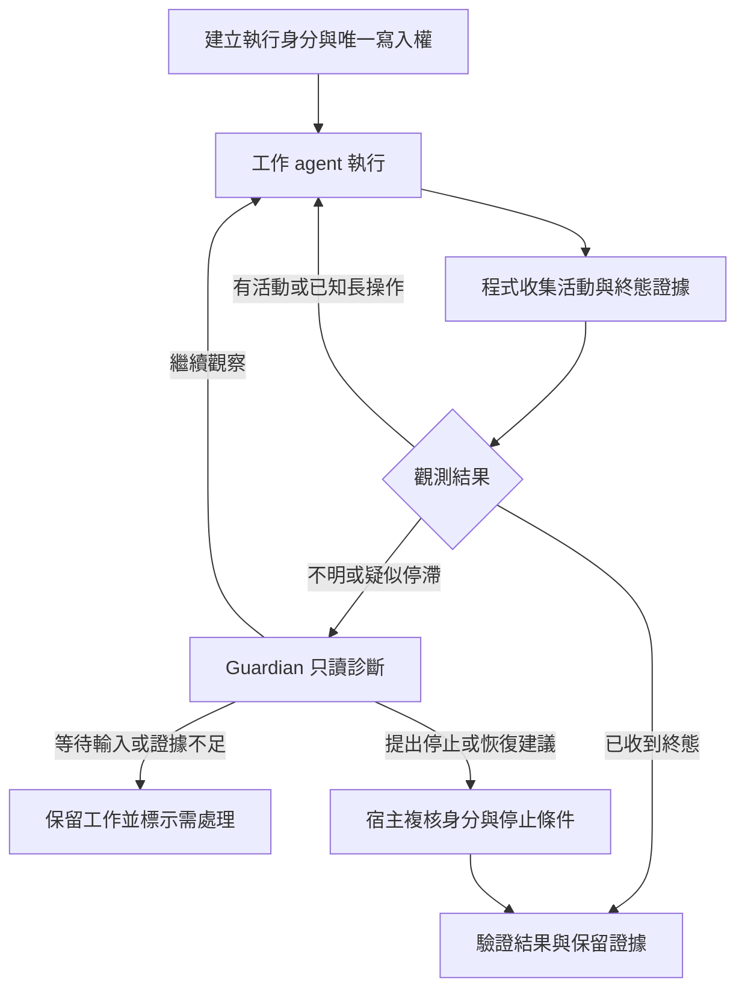

# 所有 AI CLI 的長任務與按需監督計畫

2026-09-09｜狀態：共用觀測、取消隔離與唯讀診斷已實作；原生不限時與真實任務驗收尚未通過，正式設定未啟用。實作前基準：580145011f4ab7596f0d03c88128d29dfea810a9。

## 本輪實作與限制

- [能力契約](../../src/engines/capabilities.ts) 覆蓋全部 10 個真實接頭及 mock，型別與資料驅動測試對照 schema。每個設定 tag 另列 command、時限及待驗項目；`execution capabilities` 不呼叫 provider，也不猜目前版本。
- [執行觀測](../../src/engines/execution-observation.ts) 保存每輪 executionId、taskId、宿主與 worker 身分、活動／進展／終態。輸出即時排空、解析有界、重複事件去重；不保存 prompt、原始輸出或工具參數。每 60 秒取樣，連續 5 次缺少進展只觸發診斷。
- 10 個接頭均接上 [共用控制介面](../../src/engines/run-control.ts)。取消、部分結果及未確認的橋接停止會保留工作區；scheduler 不補催、不重試、不合併，團隊寫入權與 Freebuff session 保持隔離。GitHub runner 同樣擋住重派，既有失敗次數與紀錄保留。
- [supervisor](../../src/supervisor/supervise.ts) 在處置前讀取觀測；活動中、未知或損壞紀錄均阻止回收／重派。observed 模式不因時間回收 daemon，即使觀測尚未落地。單專案及 fleet 共用此規則。
- [Guardian](../../src/guardian/fleet.ts) 對活動工作採唯讀、停用工具的診斷參數，只接受建議；不呼叫原有修碼／驗證／重啟流程。每次診斷最多 120 秒，同事故含失敗均冷卻 60 分鐘，新活動會使舊建議失效。inline 巡檢將活動工作診斷交給獨立程序，`--guardian only` 本身只觀測，不啟動或回收 daemon。

`engines.<tag>.executionMode="observed"` 可選用以上觀測路徑，保留既有 CLI／wall／idle 限制；預設設定與正式暫停旗標保持原狀。`supervised` 只開放離線 mock，真實接頭在 schema 與 registry 均被能力閘拒絕。agy 的零時限也會明確拒絕，避免舊實作誤轉成 1 秒。**目前不是已啟用不限時；10 個真實接頭的不限時驗收仍為 0/10。**

```powershell
node dist/cli.js execution capabilities --config configs/autodev-self.json
node dist/cli.js execution list --config configs/autodev-self.json
node dist/cli.js execution cancel --config <設定檔> --id <executionId>
```

取消指令只建立綁定 executionId 與宿主啟動身分的請求，由觀測器在下一次取樣處理。現階段會停止本機 transport，並將後端視為未確認；它不是原生優雅取消／後端完全停止的驗收證據。沒有提供自動清除隔離或重新派工的捷徑。agy 停止不明時也保留 WSL Git 對應，確認後端結束後才可恢復 Windows 對應。真實停止、PID 重用、跨 WSL／session／pane 的收斂與安全接續仍須逐 CLI 驗證。

本機僅執行 --help／--version 的版本快照（2026-09-09）：

| 接頭 | 版本 | 原生不限時、停止／接續、真實任務 |
|---|---|---|
| Claude Code | 2.1.259 | 待驗 |
| Codex | 0.153.4 | 待驗；目前接頭使用 ephemeral |
| agy | 1.1.28 | print-timeout 仍有限制；部分結果 exit 0 已有拒收回歸 |
| Copilot | 1.0.82 | 待驗 |
| Qwen | 0.23.0 | 待驗 |
| Grok | 1.0.13 | 待驗 |
| OpenCode | 1.18.29 | 待驗；provider／chunk 限制分開保留 |
| Devin | 3000.4.16 (355c3c9e) | 待驗 |
| Herdr | 未呼叫 | launcher／pane 能力與真實執行需本次明確授權 |
| Freebuff | 未呼叫 | MCP／session 能力與真實執行需本次明確授權 |

共用程序與觀測測試包含三小時虛擬時間、靜默、重複輸出、跨 chunk 文字、過大／損壞 JSON、觀測寫入失敗、取消、Guardian 越權／過期／逾時及 GitHub 不重派。這些是假程序／隔離 Git 測試，不代表真實模型或所有原生 CLI 通過。正式啟用仍遵循下方 P0–P4 門檻。

Guardian 唯讀 profile 使用目前官方文件列出的 `default_permissions=":read-only"`；工具停用參數與無副作用宿主分支另有本機回歸，實際 CLI 權限邊界仍須 canary。[OpenAI 設定參考](https://learn.chatgpt.com/docs/config-file/config-reference)

讓正常工作的 agent 持續解題，由程式定期觀測；疑似停滯時才交給 Guardian 判讀。時間經過、輸出安靜或心跳過期，單獨都不是終止工作、重新派工或宣告失敗的依據。

適用範圍是 AutoDev NG 所有現有及後續接入的 AI CLI，包含目前未啟用的接頭、同接頭的不同 engine tag，以及 Herdr／Freebuff 橋接入口。最終交付必須覆蓋全部接頭；單一 CLI 試行只是驗證順序，不代表縮小範圍。共同接通 scheduler、supervisor、Guardian 與一般 GitHub Issue runner。這份文件是設計與驗收計畫，不是新的 GOAL 或背景排程。

## 全接頭覆蓋範圍

以 [registry](../../src/engines/registry.ts) 及 [EngineConfigSchema](../../src/types.ts) 為完整名單：目前 10 個真實接頭，另有 mock 供離線測試。下表是目前接頭原始碼的行為，不是所有 CLI 最新版本的能力保證；原生不限時、即時觀測、接續及取消都須逐項實測。

| 接頭 ID | 目前接法／結果證據 | 必須完成的適配 |
|---|---|---|
| claude-cli | [Claude Code](../../src/engines/claude-cli.ts)：共用 proc，最終 JSON 結果與 commit | 確認可用的即時事件與工作階段識別；保留原生失敗判讀，安靜期間交給共用監督 |
| codex | [Codex CLI](../../src/engines/codex.ts)：共用 proc，JSONL、turn.completed 與 commit | 串接即時事件、執行／thread 身分及取消；每輪完成與整項任務完成分開判讀 |
| agy | [Antigravity CLI](../../src/engines/agy.ts)：WSL、純文字及 print-timeout | 修正零時限映射，驗證 stream-json、部分結果、conversation 接續與跨 Windows／WSL 的停止確認 |
| copilot | [GitHub Copilot CLI](../../src/engines/copilot.ts)：共用 proc，result 尾事件及其 exitCode | 轉譯活動事件，驗證 session 與取消；缺失或中途結果不能變成完成 |
| qwen | [Qwen CLI](../../src/engines/qwen.ts)：共用 proc，JSON 陣列／result 事件 | 確認執行中可取得的事件；主工作、背景操作與錯誤分開記錄 |
| grok | [Grok CLI](../../src/engines/grok.ts)：共用 proc，可能含前綴訊息的多行 JSON | 確認可辨識的完整終態及狀態查詢；未提供即時訊號時保持 unknown，不偽造進度 |
| opencode | [OpenCode](../../src/engines/opencode.ts)：共用 proc，NDJSON、step_finish 與成本 | 轉譯活動、session 與取消；step_finish 不直接等同任務完成，單次 provider／chunk timeout 與任務總時限分開 |
| devin | [Devin CLI](../../src/engines/devin.ts)：共用 proc，prompt／export 檔與 token 統計 | 確認 export 的終態與執行中可見性；讀取不完整 export 不能觸發成功或誤殺 |
| herdr | [Herdr 接頭](../../src/engines/herdr.ts)：PowerShell launcher、TimeoutMs／WaitTimeoutMs、AUTOPILOT_WAIT_OK | 對齊 launcher、等待端與實際 pane／worker 的生命週期；外層停止等待不等同內層已停止 |
| freebuff | [Freebuff 接頭](../../src/engines/freebuff.ts)：自有 MCP stdio、正值 wall timeout、每使用者 session 鎖 | 納入共用觀測與控制契約；檢查 MCP 等待、max_agent_steps、取消通知／回覆與 session 是否仍在工作，不能只修改 proc |
| mock | [測試接頭](../../src/engines/mock.ts) | 支援假時鐘、靜默、重複輸出、失聯與取消故障；不計入 10 個真實接頭的驗收數 |

各接頭及實際 engine tag 都要有驗收列，記錄 command／版本／平台／呼叫模式、內外層限制、觀測方式、停止與接續證據。不同 CLI 版本或 wrapper 路徑不能共用未經核對的能力結論。新增 registry 接頭時，缺少覆蓋列或契約測試即不能通過「全接頭支援」檢查。

首輪可先用已具結構化事件的接頭驗證共用機制，再處理純文字／export 與橋接差異；10 個接頭全部保留在交付清單。原生限制或缺少執行授權的項目記為待解／待驗，不以略過或 mock 通過冒充支援完成。Herdr／Freebuff 等入口的現有使用授權與模型路由規則仍適用。

## 已確認的基礎與缺口

以下是本機原始碼、agy 1.1.28 的 --help／--version，以及官方文件的查閱結果；不代表服務已在執行。

| 位置 | 現況 | 必須處理的缺口 |
|---|---|---|
| [全部接頭 registry](../../src/engines/registry.ts) | 8 個直接 CLI 多數共用 proc；Herdr 經 launcher，Freebuff 自行管理 MCP 程序與計時器 | 共用 Engine 生命週期、觀測／控制契約必須覆蓋每條入口，不能只修改 agy 或假設全部走 proc |
| [agy 接頭](../../src/engines/agy.ts) | 預設 15 分鐘；宿主時限再換算成 CLI 的 print-timeout | timeoutMs=0 會被換算為 1 秒；不能直接設零。CLI client 的結束也未必代表後端工作已停止 |
| [共用程序執行器](../../src/engines/proc.ts) | timeoutMs=0 已可停用宿主總時限；onActivity 只反映 stdout/stderr | idle timeout 會直接終止程序；目前沒有逐段結構化事件觀測或外部取消介面 |
| [設定 schema](../../src/types.ts) | 零總時限必須搭配正值 idleTimeoutMs | 新模式必須以監督契約取代「安靜一段時間就終止」，不能只刪除檢核 |
| [scheduler](../../src/scheduler.ts)、[heartbeat](../../src/engines/heartbeat-write.ts) | 有 executionId、團隊租約與任務起訖心跳 | daemon 心跳、租約續期、工作活動與實際進展尚未分開；租約正常不證明任務有進展 |
| [supervisor](../../src/supervisor/supervise.ts)、[健康分類](../../src/supervisor/health.ts) | 可探測程序、心跳與子程序；另有 30 分鐘 watchdog、預設 90 分鐘長輪寬限 | 活動證據不足時仍可能先終止程序；Windows 程序名稱清單不能證明 WSL 內 agy 的真實工作狀態 |
| [supervise CLI](../../src/cli/supervise.ts) | fleet 路徑先執行 supervisor，再呼叫 Guardian | 必須先觀測與判讀，再決定動作；單一 --config 路徑目前也未呼叫 Guardian |
| [Guardian](../../src/guardian/fleet.ts)、[事故辨識](../../src/guardian/incident.ts) | 已有健康時零 LLM、鎖、事故去重、冷卻與結構化決策 | 現有 Guardian 可改事故範圍程式碼，驗收還會呼叫具有副作用的 supervisor；不適合直接監督仍在寫入的工作 agent |
| [GitHub job](../../src/github/job.ts) | 一般 runner 明確拒絕 timeoutMs=0；自動報告修復另外限定 Codex／Freebuff | 一般 runner 改按監督能力契約放行；長任務能力與自動報告修復資格分開驗收，不能順手刪除修復路由限制 |

agy 官方更新紀錄指出，1.1.28 的 print-timeout 在工作途中到期，可能輸出部分結果並以 exit 0 結束。因此成功必須核對終態與產物，不能只看 exit 0 或 commit 有前進。[官方 CHANGELOG](https://github.com/google-antigravity/antigravity-cli/blob/main/CHANGELOG.md#1128)

本機 help 提供 stream-json 輸入／輸出、conversation ID 接續及 log-file；官方也記載 stream-json 輸入可在同一 conversation 執行多輪。這些是能力試驗的入口，尚不能證明單輪不限時、唯讀查詢或安全取消已成立。[官方 CHANGELOG](https://github.com/google-antigravity/antigravity-cli/blob/main/CHANGELOG.md)

## 預定流程



Guardian 的文字判斷不是終止權限。宿主必須重新讀取同一執行的最新狀態；決策過期、已出現新進度、身分不符或探測失敗，都撤銷介入。第一版的疑似停滯只進入診斷與人工處理，不自動強制終止。

## 觀測與判讀契約

沿用 Engine／Job 的生命週期、executionId、事件紀錄與原子寫入；每個執行保存自己的觀測狀態，避免並行任務互相覆蓋心跳。scheduler 與 supervisor 使用同一份觀測／控制契約，各接頭只負責翻譯自己的原生事件、識別工作階段、判讀終態與執行取消握手。不限時、失聯、疑似停滯、人工停止及唯一寫入者的規則共用，不在十個接頭各寫一套。

最少需要以下資料：

- 執行身分：project、taskId、executionId、工作目錄、宿主／工作程序 PID 與啟動時間；WSL run marker、conversation ID 能取得時一併保存。
- 活性：最後一次成功觀測、程序／工作階段狀態及觀測錯誤。CPU、輸出位元組與檔案時間戳只作輔助訊號。
- 活動與進展：最後事件序號、工具開始／結束、目前操作、可驗證的檢查點。計時心跳與重複輸出不更新「有效進展」。
- 終態：完成／失敗／取消的來源證據、CLI 結束碼、後端是否仍有工作、驗證結果與收尾是否完成。未知值保持未知。

| 觀察到的情況 | 決策 |
|---|---|
| 新的工具事件、測試結果或有效檢查點 | 繼續工作；清除已失效的疑似停滯狀態 |
| 正在已知的長測試／建置／模型等待階段 | 保留工作，依該操作狀態查證；安靜或低 CPU 不足以判定卡死 |
| 程序還在，但僅重複相同訊息、沒有可確認的進展 | 保存多次快照，送 Guardian 判讀；不直接宣告成功或卡死 |
| 觀測失聯、資料損壞、程序探測失敗 | 標示 unknown，保留既有寫入權；禁止因此重新派出另一個工作 agent |
| 明確等待登入、權限或使用者輸入 | 標示 waiting_input，暫停同任務的自動重試，呈現需要的操作 |
| CLI 結束但缺少後端終態，或只得到部分結果 | 保留工作區與執行身分，查證後端；不能清理工作區或直接重跑 |
| 取得明確終態 | 進入既有驗證與記帳；完成仍須符合任務驗收契約 |

初始巡檢間隔採 60 秒；連續 5 次無法確認工作活動時觸發一次診斷，這是診斷門檻，不是工作時限。沿用 Guardian 同事故 60 分鐘冷卻；新終態、明確失敗或使用者停止不受冷卻阻擋。門檻在隔離試行後依誤報情況調整。

輸出持續排空，JSON 逐段解碼並限制緩衝大小；事件紀錄沿用輪替，檢查點只讀任務範圍。送給 Guardian 的內容須遮罩敏感資料，並將日誌／工具文字視為不可信證據。

## Guardian、停止與恢復

1. **按需診斷。** 沿用既有 Guardian 的事故去重、鎖、結構化回覆與用量紀錄。活動中的任務採唯讀診斷路徑，讓工作 agent 保持唯一寫入者；以執行權限與工具限制驗證此邊界，不能只靠提示詞。舊有修碼、驗證建置及強制重啟路徑不直接套入。
2. **詢問工作 agent 是待驗能力。** 先測同一 conversation 是否有不開新輪、不中斷工作的狀態查詢。若發送提示會啟動新一輪，就不能拿它當心跳；改查事件／工作狀態，缺證據時回報 unknown。
3. **診斷器故障不連坐。** Guardian 自己保留有界診斷呼叫、重試與冷卻；逾時、無效 JSON 或無回覆，只標示監督降級並保留工作。機械巡檢須能繼續，不被一次 Guardian 呼叫堵住；不再啟動另一層 LLM 監督 Guardian。
4. **暫停與取消分開。** 保留 .adng.stop 阻止新派工／自動恢復的語意。使用者明確取消目前工作時，透過宿主對指定執行發送優雅停止；只有取消未收斂且身分已再次核對，才精準處理該執行的程序。restart.request 目前在 cycle 邊界處理，不能當作中途取消已生效的證據。
5. **確認停止才能交接。** 依接頭核對程序樹、WSL marker、後端 conversation、Herdr pane／request 或 Freebuff session 與尚未完成的工作。MCP cancelled 通知、CLI 退出或 launcher 停止等待，都不能單獨證明真正工作已停止。停止無法確認時保持 unknown／隔離，保留差異與鎖定證據；禁止清空工作區、刪鎖後搶寫或盲目啟動第二份任務。
6. **保留失敗歷史。** 疑似停滯不消耗 maxAttempts；已確認的執行失敗照既有規則記帳。使用者取消與基礎設施錯誤保留各自原因，不能改任務 ID 或清零失敗次數來規避上限。恢復必須使用可辨識的新執行身分，連結原執行與保留的檢查點。

單次連線、狀態查詢與取消握手仍有逾時；測試／建置採其自身可調整的契約，不把短命令預設直接套在長建置上。任務總時長與這些操作的限制分開。

既有成本／attempt 上限保留。agy 等接頭成本回報 unknown，且現有成本門檻主要在派工前檢查；因此不能宣稱已有執行中即時金額斷路器。每個接頭分別記錄 worker、Guardian 用量可見性，未知費用不可當成零元。原生步數／輪數限制另列，不自動移除使用者設定；若需接續，仍須保留同一任務的歷史與驗收契約。

## 實作順序與退出條件

| 階段 | 工作與沿用位置 | 通過條件 |
|---|---|---|
| P0：全接頭能力契約 | 盤點 10 個接頭的 command／版本／平台、內外層時限、事件與終態、工作階段觀測／接續、取消。先原始碼／help／官方文件，再離線重播與有授權的小型隔離探針 | 名單與 registry／schema 一致；每個接頭明確區分真正單輪無總時限、可安全接續的有限等待、僅有限時或尚待驗證，部分結果不會被當成成功 |
| P1：共用觀測與逐接頭適配 | 沿用 Engine／Job、EventLog 與原子寫入，串接 proc 的逐段事件與執行身分；Freebuff 自有 MCP、Herdr launcher 同樣提供共用觀測資料 | 每個接頭均能表達活動、進展、等待、未知與終態；觀測器故障不影響 worker；本階段既有時限仍在，尚不能宣稱不限時 |
| P2：共用處置與逐接頭取消 | 調整 supervisor／health／CLI，先收集證據再做動作；每條入口接上取消、停止確認與執行身分複核 | 全接頭活動任務不因時間或失聯被直接終止；單專案與 fleet 路徑一致；人工取消可收斂，無法確認停止就隔離且不重派 |
| P3：按需 Guardian | 沿用 guardian/fleet、incident、codex 的流程與解析器，加入唯讀診斷路徑、決策新鮮度與有界呼叫；先只記錄建議 | 健康工作零 LLM；相同事故不重複轟炸；Guardian 不會與 worker 競寫，不能自行終止／重啟；Guardian 故障時巡檢仍持續 |
| P4：逐 CLI 試行與全接頭驗收 | P0–P3 通過後，以明確 opt-in 的受監督模式調整 schema／registry／全部接頭；一般 GitHub runner 按共同契約放行。每次一個隔離任務，逐接頭完成試行 | 每個接頭均有契約測試與真實任務證據；逐列記錄長時間執行、停止／恢復與結果驗收。10 個接頭全部通過才可宣稱全接頭支援 |

全部接頭採同一個明確的受監督模式開關 executionMode=supervised（真實接頭尚未通過啟用閘），配合 timeoutMs=0 表示無任務總時限。只有已驗證的接頭、有效的執行觀測與控制路徑齊備才准派工；schema、registry 和 runner 根據契約一致判定，不用引擎名稱特判掩蓋能力缺口。Freebuff 現有禁止零時限的檢核，必須在其監督與取消契約通過後替換，不能提前刪除。觀測器在工作途中故障時標示降級、阻止新的同任務寫入者，不把工作立刻終止。

P0 若證明任何 CLI 單輪仍有原生上限，先交付觀測與限制報告，再評估已驗證的同 session 接續方式；不能用 24 小時或超大數值冒充不限時，也不能拿自動重新發送原任務冒充接續。保留 CLI 原生限制的名稱與實際值。接續可用與單輪不限時是不同能力，各自驗收；只完成觀測不算滿足該 CLI 的不限時要求。

第一個可獨立交付的變更是 P0 的全接頭能力清單與共用契約檢查，再補各接頭終態判讀回歸；其後每階段逐列驗證。沿用既有模組，只在共享執行觀測確有需要時新增小型 helper。

## 驗收矩陣

| 情境 | 必須得到的結果 |
|---|---|
| 虛擬時間跨過舊 15／30／90／120 分鐘門檻，任務持續有進展 | 沒有 wall kill、沒有新寫入者、attempt 未被提前結算 |
| 長測試無 stdout，或模型長時間無事件 | 保留工作；無證據時送診斷／標示 unknown，不依安靜直接終止 |
| 無限重複日誌但工具／檢查點沒有變化 | 能觸發疑似停滯診斷；不能靠垃圾輸出永遠被判定有進展 |
| 失聯、壞 JSON、部分 UTF-8／跨 chunk 事件、超大輸出 | 有界記憶體與紀錄；可恢復解析或標示降級，保留 worker |
| agy 1.1.28 部分結果加 exit 0、甚至已有 commit | 不宣告完成；要求明確終態及任務驗證 |
| CLI relay 結束，WSL／後端仍可能工作 | 不清理、不重派；能以相同執行身分查證或維持隔離 |
| Guardian 重複建議、過期決策、提示注入、要求改碼／殺程序 | 宿主拒絕越權／過期動作；唯一寫入者仍成立 |
| Guardian 卡住或退出 | 機械巡檢持續，工作不被連帶取消；錯誤與用量紀錄保留 |
| PID 被重用、工作已換輪、失去鎖、取消期間出現新進度 | 不處理錯誤程序；介入前重新複核執行身分與最新狀態 |
| 使用者暫停、明確取消、停止確認失敗、恢復一次後仍失敗 | 暫停不自行重啟；取消有收斂證據；未確認停止不重派；保留歷史並按既有上限處理 |
| 正常完成 | 明確終態、實際 diff／commit、適用驗證命令及 exit code 齊備，才回報成功 |
| registry 新增接頭、同接頭新增 command／版本或 engine tag | 覆蓋率檢查發現待驗項目；不因其他 CLI 已通過就繼承未驗證能力 |
| Herdr 等待端／Freebuff MCP 回傳或取消，但內層工作仍在執行 | 共用狀態保持執行中或 unknown；不能提前釋放寫入權、清理或重派 |

離線回歸建立一組資料驅動的共用契約案例，由全部接頭執行，避免複製十套判斷邏輯。擴充既有 tests/claude-cli.test.ts、codex.test.ts、agy.test.ts、copilot.test.ts、qwen.test.ts、grok.test.ts、opencode.test.ts、devin.test.ts、herdr.test.ts、freebuff.test.ts，以及 proc、guardian、supervisor-health、scheduler／GitHub runner 測試。用 registry／schema 對照測試清單，漏接頭即失敗。以假時鐘／本機假 worker 或 fake MCP 驗證時序與故障，不使用模型配額模擬長等待。

每個實作階段跑相關測試與 typecheck；整合候選完成後跑 build、全套測試及 CLI smoke。只在隔離環境執行故障注入。每個真實接頭各安排有授權的實際任務、停止及恢復驗收，逐一記錄版本與證據；不能以 agy、Codex 或 mock 的結果代表其他 CLI。若真實任務自然執行未超過該接頭的舊時限，只能證明真實流程通過；長時段仍需獨立的可控長程序驗收，兩種證據分開報告。

驗收報告分別列出 10 個接頭的「共用契約」「原生不限時／接續方式」「觀測」「取消」「恢復」「真實任務」狀態。未驗證及受外部限制的項目仍計入總數，列明剩餘缺口；全部滿足要求以前，只報部分完成。

## 試行與回復

- 啟用前保存來源 commit、CLI 版本、設定雜湊、工作區基線與既有暫停狀態；設定變更依日期備份。
- 每個接頭從一個隔離任務開始，逐一試行，關閉對外發布，留下觀測、Guardian 決策、動作收據及最終驗證；不把原先逾時的試跑結果改寫成成功。
- 啟用門檻：P0–P3 通過，使用者能停止目前任務，觀測失效會阻止重複派工，並已實測 CLI／後端工作如何收斂。
- 回復時先阻止新派工，讓現有執行完成或經已授權取消收斂，再回復模式；保留工作區、事件與失敗收據。只有回復設定檔不代表活動中的舊工作已停止。

本次規劃的文件檢查只涵蓋內容、相對連結、差異與變更範圍；以上執行與故障驗收均待實作後完成。
